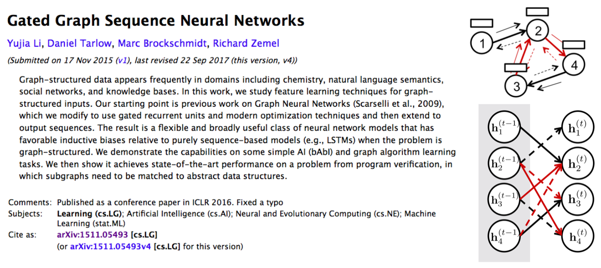
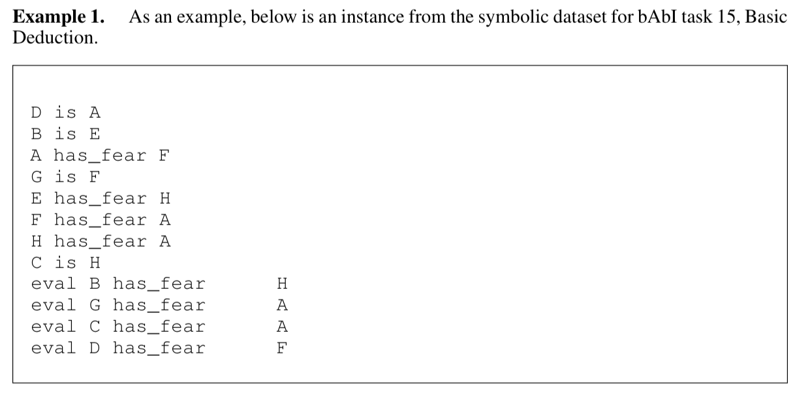

# A PyTorch Implementation of GGNN

This is a PyTorch implementation of the Gated Graph Sequence Neural Networks (GGNN) as described in the paper [Gated Graph Sequence Neural Networks](https://arxiv.org/abs/1511.05493) by Y. Li, D. Tarlow, M. Brockschmidt, and R. Zemel. This implementation gets 100% accuracy on node-selection bAbI task 4, 15, and 16. Their official implementation are available in the [yujiali/ggnn](https://github.com/yujiali/ggnn) repo on GitHub.

    

## What is GGNN?
- Solve graph-structured data and problems
- A gated propagation model to compute node representations
- Unroll recurrence for a fixed number of steps and use backpropogation through time
- An output model to make predictions on nodes

## Requirements
- python==2.7
- PyTorch>=0.2

## Run 
Train and test the GGNN:
```
python main.py --cuda (use GPUs or not)
```

Suggesting configurations for each task:
```
# task 4
python main.py --task_id 4 --state_dim 4 --niter 10
# task 15
python main.py --task_id 15 --state_dim 5 --niter 10
# task 16
python main.py --task_id 16 --state_dim 10 --niter 150
```

## Results
I followed the paper, randomly picking only 50 training examples for training.
Performances are evaluated on 50 random validation examples.

| bAbI Task | Performance |
| ------| ------ | 
| 4 | 100% | 
| 15 | 100% |
| 16 | 100% |

Here's an example of bAbI deduction task (task 15)



## Disclaimer
The data processing codes are from official implementation [yujiali/ggnn](https://github.com/yujiali/ggnn).

## TODO 
- [ ] GraphLevel Output

## References
- [Gated Graph Sequence Neural Networks](https://arxiv.org/abs/1511.05493), ICLR 2016
- [yujiali/ggnn](https://github.com/yujiali/ggnn)
